<table>
    <tr>  <!-- ------------------------------------------------------------------------------------------ -->
          <th>
                    Header 1
          </th>
          <!-- ------------------------------------------------------------------------------------------ -->
          <th>
                    Header 2
          </th>
          <!-- ------------------------------------------------------------------------------------------ -->
          <th>
                    Header 3
          </th>
    </tr>
<!-- XXXXXXXXXXXXXXXXXXXXXXXXXXXXXXXXXXXXXXXXXXXXXXXXXXXXXXXXXXXXXXXXXXXXXXXXXXXXXXXXXXXXXXXXXXXXXXXXXXXX -->
    <tr>
          <td colspan="3">
                    This cell spans all three columns
          </td>
    </tr>
<!-- XXXXXXXXXXXXXXXXXXXXXXXXXXXXXXXXXXXXXXXXXXXXXXXXXXXXXXXXXXXXXXXXXXXXXXXXXXXXXXXXXXXXXXXXXXXXXXXXXXXX -->
    <tr>  
          <td>      <!-- --------------------------------------------------------------------------- -->
                    Normal cell
          </td>     <!-- --------------------------------------------------------------------------- -->
          <td colspan="2">      <!-- --------------------------------------------------------------------------- -->
                    This cell spans two columns
          </td>     <!-- --------------------------------------------------------------------------- -->
    </tr>
<!-- XXXXXXXXXXXXXXXXXXXXXXXXXXXXXXXXXXXXXXXXXXXXXXXXXXXXXXXXXXXXXXXXXXXXXXXXXXXXXXXXXXXXXXXXXXXXXXXXXXXX -->
    <tr>
          <td colspan="2">
                    This spans two columns
          </td>
          <!-- ------------------------------------------------------------------------------------------ -->
          <td>
                    Normal cell
          </td>
    </tr>
</table>


# Sparse Identification of Non-linear Dynamical Systems (SINDy)[1]

In this section, we teach, create, simulate, and visualize the Sparse Identification of Non-linear Dynamical Systems (SINDy) [1] model implemention in NGC-Learn library (JAX). After going through this demonstration, you will:

1.  Learn how to discover the differential equation of a dynamical system using SINDy algorithm only by the system's stapshots.
2.  Learn how to build polynomial libraries with arbitrary order out of the dataset.
3.  Learn how to solve the sparse regression problem in 2 ways
   - Iteratively finding the coefficient matrix by gradient descent.
   - Iteratively performing the least squares (LSQ) method followed by thresholding-- Sequential Thresholding Least Square (STLSQ) for the given model.
   
   
The model **code** for this exhibit can be found [here](https://github.com/NACLab/ngc-museum/exhibits/sindy/sindy.py).


## SINDy 
<div align="justify">
SINDy is a data-driven algorithm that discovers the governing behavior of a dynamical system in terms of symbolic differential equation. It solves the sparse regression problem over the coefficients of pre-defined library that includes $p$ candidate predictors. It tries to find sparse model that only uses $s$ predictors out of $p$ where $s\leqp$ that best describes the dynamics (time-derivatives) of the system only from the dataset collected over time. SINDy assumes systems follow parsimonious theorem where the balace between the complexity and accuracy results generalization.
</div>


### SINDy Dynamics

If $X$ is a system that only depends on variable $t$, a very small change in the independant variable ($dt$) can cause changing the system by $dX$ amount. 
```math
d\mathbf{X} = \mathbf{Ẋ}(t)~dt
```
SINDy models the derivative[^1] (a linear operation) as a linear transformations with:
[^1]: Derivative is a linear operation that acts on dt and gives the differential that is the linearization approximation of the taylor series of the function.
```math
\frac{d\mathbf{X}(t)}{dt} = \mathbf{Ẋ}(t) = \mathbf{f}(\mathbf{X}(t))
```
SINDy assumes thatt this linear operation, $\mathbf{f}(\mathbf{X}(t))$ is a matrix multiplication that linearly combines the relevant predictors to describe the system's equation.
```math
\mathbf{f}(\mathbf{X}(t)) = \mathbf{\Theta}(\mathbf{X})~\mathbf{W}
```


Given a group of candidate functions in the library $\mathbf{\Theta}(\mathbf{X})$, the coefficient $\mathbf{W}$ of choose the library terms is **sparse**. In other words, there are only a few functions that exist in the system's differential equation. Given these assumptions, SINDy solves the sparse regression problem to find the $\mathbf{W}$ that maps the library selected terms to each feature of the system. SINDy imposes parsimony constraints over symbolic regression (i.e., genetic programming) to describe a dynamical system's behavior by as few terms as possible. In order to select a sparse set of the given features, it adds the LASSO regularizarion (i.e., L1 norm) to the regression problem and solves the sparse regression or solves the regression problem by STLSQ. Here we desceibe STLSQ in third step of the SINDy dynamics.


SINDy's dynamics can be presented in 3 main phases according to the figure 1. 

<p align="center">
  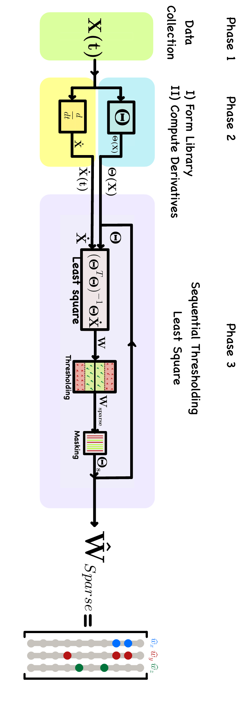
   
**Figure 1:** **Flow of three phases in SINDy.** **Phase-1)** Data collection: capturing system's states that are changing in time and making the state vector. **Phase-2A)** Library formation: manually creating the library of candidate predictors that could appear in the model. **Phase-2B)** Derivative computation: using the data collected in phase 1 and compute its derivative with respect to time. **Phase-3)**  Solving the sparse regression problem (here with STLSQ).
</p>

------------------------------------------------------------------------------------------
<!-- ----------------------------------------------------------------------------------------------------------------------------------------------------------------------------------------------------------------- -->

<table>
   
<tr>
<td width="70%" valign="top">
   
## Phase 1: Collecting Dataset → $\mathbf{X}_{(m \times n)}$
This phase involves gathering the raw data points representing the system's states across time; In this example, capturing the x, y, and z coordinates of the system's states in this.
</td>
<td width="30%" align="top">
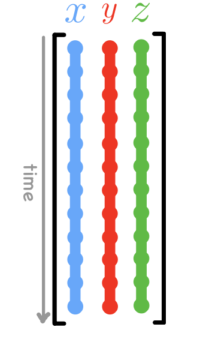
</td>
</tr>

</table>

<!-- ----------------------------------------------------------------------------------------------------------------------------------------------------------------------------------------------------------------- -->


<table>

<tr>
<td width="70%" valign="top">
   
## Phase 2: Processing

### 2.A: Making Library  → $\mathbf{\Theta}_{(m \times p)}$
In this step, using the dataset collected in step 1, given the pre-defined function terms, we construct the dictionary of candidate predictors for system's differential equations. These functions form the columns of our library matrix $\mathbf{\Theta}(\mathbf{X})$. To identify the dynamical structure of the system this library of candidate functions appear in the regression problem to propose the model's structure that later the coefficient matrix will give weight to them according to the problem setup. Assuming sparse models for the system, by sparsification (LASSO or thresholding weigths) decide which structure best describe the system's behavior using predictors. 
Given a set of time-series measurements of a dynamical system state variables ($\mathbf{X}_{(m \times n)}$) we construct:
Library of Candidate Functions: $\Theta(\mathbf{X}) = [\mathbf{1} \quad \mathbf{X} \quad \mathbf{X}^2 \quad \mathbf{X}^3 \quad \sin(\mathbf{X}) \quad \cos(\mathbf{X}) \quad ...]$
</td>

<td width="30%" align="top">
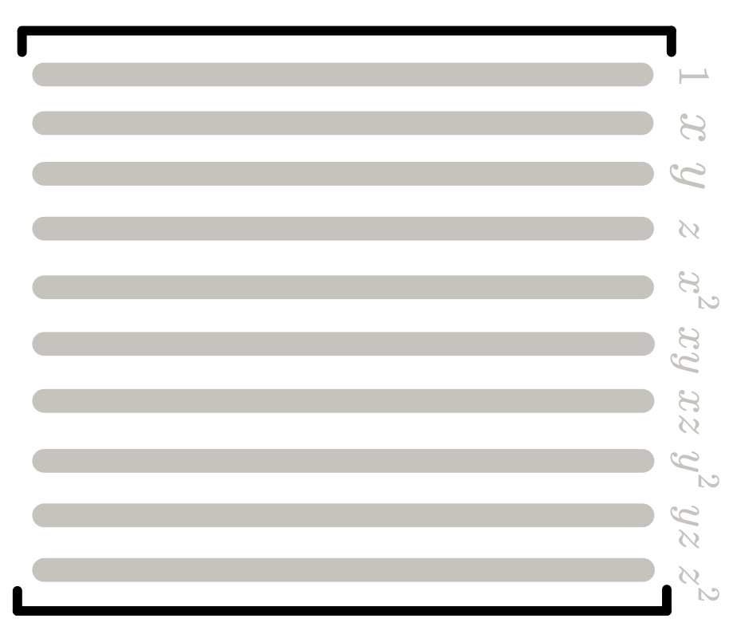
</td>
</tr>


<tr>
<td width="70%" valign="top">
   
### 2.B: Compute State Derivatives → $\mathbf{Ẋ}_{(m \times n)}$
Given a set of time-series measurements of a dynamical system state variables $\mathbf{X}_{(m \times n)}$ we construct the derivative matrix: $\dot{\mathbf{X}}_{(m \times n)}$ (computed numerically)
In this step, using the dataset collected in step 1, we calculating the time derivatives of each state variable with respect to time. In this example, we compute ẋ, ẏ, and ż to capture how the system evolves over time.


</td>
<td width="30%" align="top">
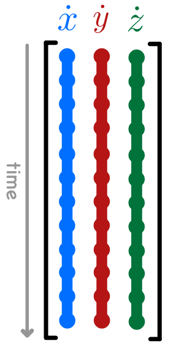
</td>
</tr>

</table>


<!--
| Left-aligned | Center-aligned | 
|:-------------|:-------------:|
| Left         | Center        | 
| A         | 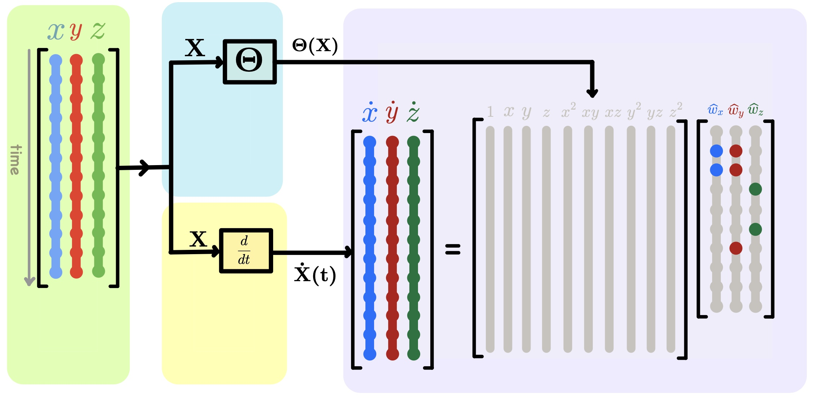          | 
| B         |           | 
| C         |           | 
-----------------------------------------------------------------------------------------------------------------------------------------------------------------------------------------------------------------


<table>

<tr>
<td width="100%" valign="top">
   
## Phase 3: Sequential Thresholding Least Square (STLSQ)

<p align="center">

</p>
</td>
</tr>


<tr>
<td width="50%" valign="top">
   
### 3.A: Least Square method (LSQ) → $\mathbf{W}$ 
Finds library coefficients by solving the following regression problem $\mathbf{Ẋ} = \mathbf{\Theta}\mathbf{W}$ analytically $\mathbf{W}  = (\mathbf{\Theta}^T \mathbf{\Theta})^{-1} \mathbf{\Theta}^T \mathbf{Ẋ}$ 
</td>

<td width="50%" valign="top">
<p align="center">
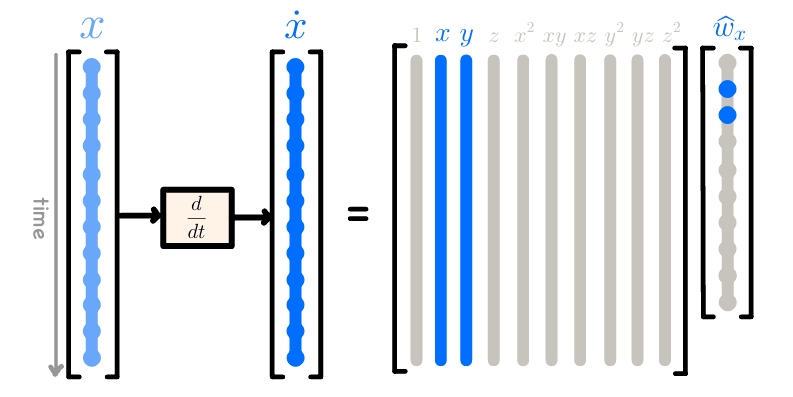
</p>
</td>
</tr>


<tr>
<td width="50%" valign="top">
   
### 3.B: Thresholding → $\mathbf{W_s}$
Sparsifies $\mathbf{W}$ by keeping only some terms in $\mathbf{W}$ that corresponds to the effective terms in the library.
</td>
<td width="50%" valign="top">
<p align="center">

</p>
</td>
</tr>

<tr>
<td width="50%" valign="top">
   
### 3.C: Masking → $\mathbf{\Theta_s}$
Sparsifies $\mathbf{\Theta}$ by keeping only the corresponding terms in $\mathbf{W}$ that are kept.
</td>
<td width="50%" valign="top">
<p align="center">

</p>
</td>
</tr>


<tr>
<td width="70%" valign="top">
   
### 3.D: Repeat A → B → C until convergence
Solving LSQ with the sparse matrix $\mathbf{\Theta_s}$ and $\mathbf{W_s}$ and find the new $\mathbf{W}$ and repreat steps B and C everytime.

</td>
<td width="30%" align="center">

  
  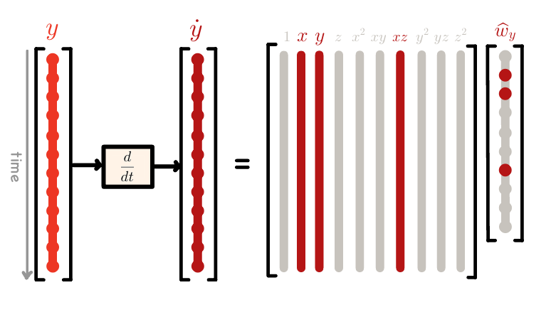
  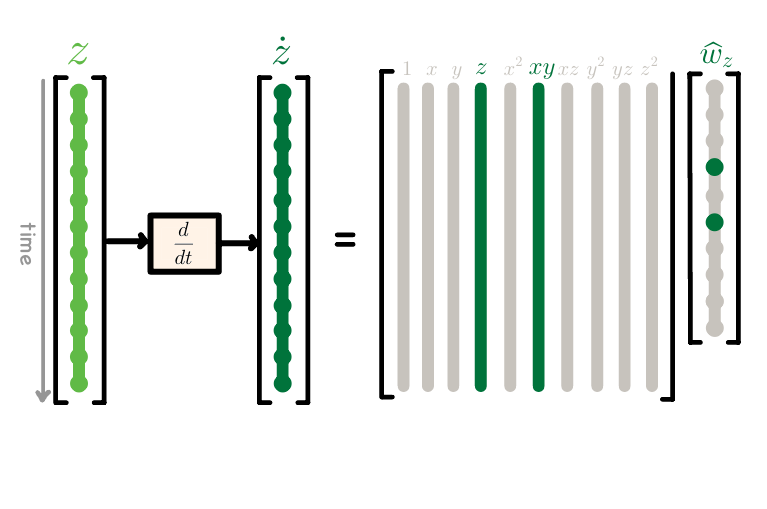
</td>
</tr>
</table>
 

D-->

-----------------------------------------------------------------------------


## Results


<p align="center">
  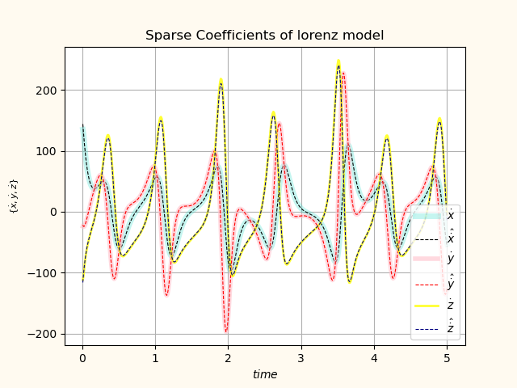
  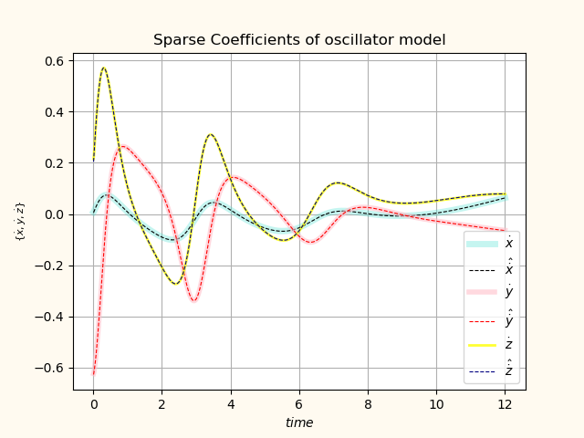
</p>

<p align="center">
  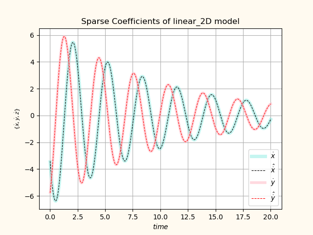
  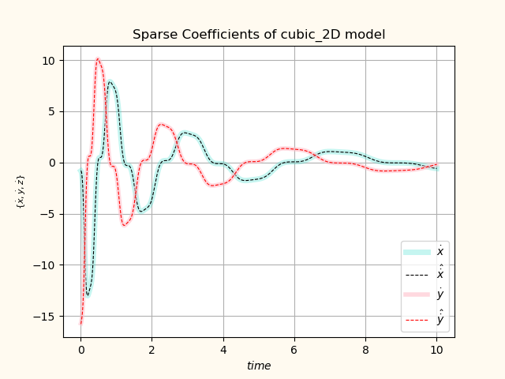
  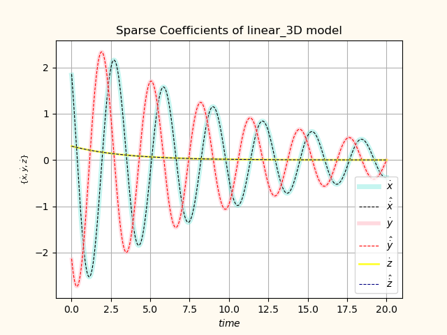
</p>


<!--
-----------------------------------------------------------------------------
Dictionary learning combined with LASSO (L1-norm) promotes the sparsity of the coefficient matrix which allows only governing terms in the dictionary stay non-zero.

The solve linear regression by lasso that is the L1-norm regularized least squares to penalize L1-norm of weights (coefficients).
lasso solution is the sparse model with coefficients corresponding to the relevant features in the library that predicts the motion of the system.

of a manually constructed dictionary from the state vector by a coefficient matrix.

-----------------------------------------------------------------------------o

-->


## References
<b>[1]</b> Brunton SL, Proctor JL, Kutz JN. Discovering governing equations from data by sparse identification of nonlinear dynamical systems. Proc Natl Acad Sci U S A. 2016 Apr 12;113(15):3932-7. doi: 10.1073/pnas.1517384113. Epub 2016 Mar 28. PMID: 27035946; PMCID: PMC4839439.

