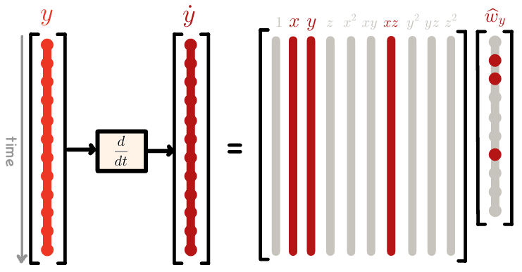
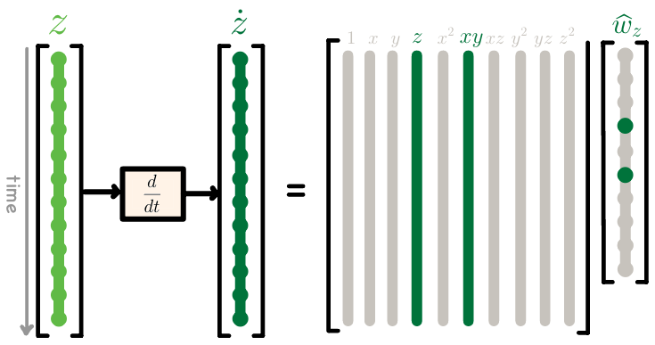

# Sparse Identification of Non-linear Dynamical Systems (SINDy)[1]
<div align="justify">
In this section, we teach, create, simulate, and visualize SINDy model implemented in NGC-Learn library. After going through this demonstration, you will:
</div>

1.  Learn how to build a SINDy model of time-series dataset, generated using Ordinary Differential Equations (ODE) of known dynamical systems used in [1].
2.  Learn how to build polynomial libraries of given dataset with arbitrary order.
3.  Learn how to solve the sparse regression problem by iteratively performing the least squares (LSQ) method followed by thresholding-- Sequential Thresholding Least Square (STLSQ)-- for the given model.
   
The model **code** for this exhibit can be found [here](https://github.com/NACLab/ngc-museum/exhibits/sindy/sindy.py).


## SINDy 
<div align="justify">
  
SINDy is a data-driven algorithm that discovers the governing behavior of a dynamical system in terms of symbolic differential equation. It solves the sparse regression problem over the coefficients of pre-defined library that includes $p$ candidate predictors. It tries to find sparse model ($s<p$) that best describes the dynamics (time-derivatives) of the system only from the dataset collected over time. 

To identify the dynamical structure of the system by sparsification of a pre-defined library coefficients.
of a manually constructed dictionary from the state vector by a coefficient matrix.
Dictionary learning combined with LASSO (L1-norm) promotes the sparsity of the coefficient matrix
which allows only governing terms in the dictionary stay non-zero.
SINDy imposes parsimony constraints over symbolic regression (i.e., genetic programming) to describe a dynamical system's behavior by as few terms as possible. In order to select a sparse set of the given features, it adds the LASSO regularizarion (i.e., L1 norm) to the regression problem and solves the sparse regression
The solve linear regression by lasso that is the L1-norm regularized least squares to penalize L1-norm of weights (coefficients).
lasso solution is the sparse model with coefficients corresponding to the relevant features in the library that predicts the motion of the system.
</div>


### SINDy Dynamics

If $X$ is a system that only depends on variable $t$, a very small change in the independant variable ($dt$) can cause changing the system by $dX$ amount. 
```math
d\mathbf{X} = \dot{\mathbf{X}(t)}~dt
```

SINDy models the derivative (a linear operation acting on $dt$) as a linear transformations with:

```math
\frac{d\mathbf{X}(t)}{dt} = \dot{\mathbf{X}(t)} = \mathbf{f}(\mathbf{X}(t))
```

It then assumes that this linear operation  $\(\mathbf{f}(\mathbf{X}(t)) \)$ is a matrix multiplication that linearly combines the relevant predictors to describe the system's equation.
```math
\mathbf{f}(\mathbf{X}(t)) = \mathbf{\Theta}(\mathbf{X})~\mathbf{W}
```
It assumes given a group of candidate functions in the library $\mathbf{\Theta}(\mathbf{X})$, the coefficient $\mathbf{W}$ that choose the library terms is sparse. In other words, there are only a few functions that exist in the system's Ordinary Differential Equation (ODE). Given these assumptions, SINDy solves the sparse regression using Sequential Thresholded Least-Squares (STLSQ) method.

-----------------------------------------------------------------------------


<p align="center">
  
</p>

-----------------------------------------------------------------------------
<p align="center">
  
</p>

-----------------------------------------------------------------------------

#### 1: Collecting dataset
#### 2: Compute state derivatives
Compute the derivative of the system's states with respect to the time.
#### 3: Create library of candidate functions
Using the dataset collected in step 1, given the pre-defined function terms, create the dictionary of candidate predictors for system's differential equations.
#### 4: Solve sparse regression

##### Solve by sequential thresholded least-squares (STLSQ) algorithm 


<p align="center">
  
  
  
</p>

<p align="center">
  
</p>


### Inputs
> Time: $ts = [t_0, t_1, \dots,  T]$
> State matrix: $\mathbf{X}_{(m \times n)}$  (t measurements of n variables)

### Inputs

   **Time**
* $ts = [t_0,~t_1, \dots,~T]$
  
   **State matrix**
* $\mathbf{X}(t)_{(m \times n)} = [x(t),~~y(t),~~z(t)]$


Given a set of time-series measurements of a dynamical system state variables ($\mathbf{X}_{(m \times n)}$) we construct:


### Data Matrix

Given a set of time-series measurements of a dynamical system state variables ($\mathbf{X}_{(m \times n)}$) we construct:
Derivative matrix: $\dot{\mathbf{X}}_{(m \times n)}$ (computed numerically)

Library of Candidate Functions: $\Theta(\mathbf{X}) = [\mathbf{1} \quad \mathbf{X} \quad \mathbf{X}^2 \quad \mathbf{X}^3 \quad \sin(\mathbf{X}) \quad \cos(\mathbf{X}) \quad ...]$

------------------


<p align="center">
  
  
</p>

<p align="center">
  
  
  
</p>


## References
<b>[1]</b> Brunton SL, Proctor JL, Kutz JN. Discovering governing equations from data by sparse identification of nonlinear dynamical systems. Proc Natl Acad Sci U S A. 2016 Apr 12;113(15):3932-7. doi: 10.1073/pnas.1517384113. Epub 2016 Mar 28. PMID: 27035946; PMCID: PMC4839439.
